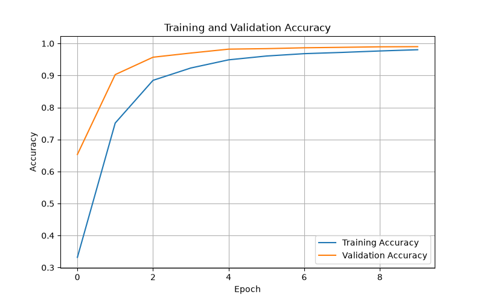
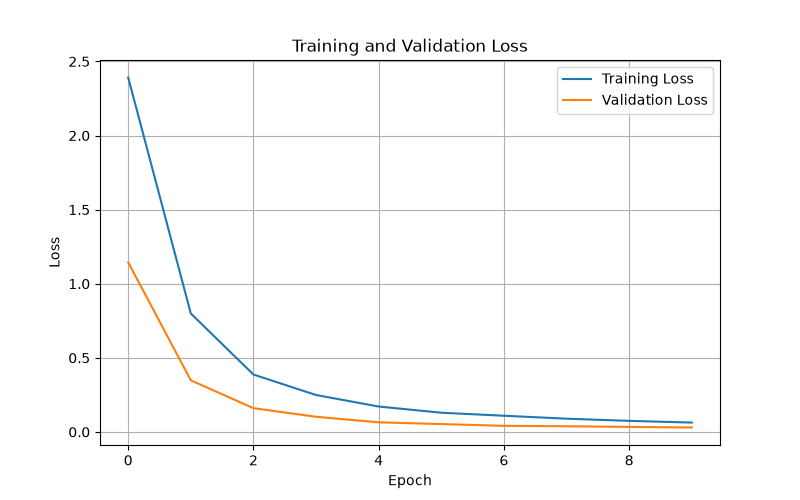

# 🚦 Traffic Sign Recognition Using Deep Learning

A Deep Learning-based Traffic Sign Recognition system that uses a Convolutional Neural Network (CNN) to classify traffic signs into 43 different categories.

The project includes data preprocessing, CNN model training, model evaluation, traffic sign prediction, and an interactive Streamlit web application where users can upload a traffic sign image and receive the predicted traffic sign with a confidence score.

## 📌 Project Overview

Traffic signs play an important role in road safety and intelligent transportation systems.

This project uses Computer Vision and Deep Learning to automatically recognize traffic signs from images.

The system can:

- Load and preprocess traffic sign images
- Normalize image pixel values
- Split data into training and testing sets
- Train a Convolutional Neural Network
- Evaluate the trained model
- Save the trained model
- Predict traffic signs from new images
- Display prediction confidence
- Provide an interactive Streamlit web application

## 🎯 Objectives

- Build a Deep Learning model for traffic sign classification
- Use CNN for image recognition
- Classify traffic signs into 43 different classes
- Achieve high classification accuracy
- Create an interactive web application
- Upload the project to GitHub as a portfolio project

## 📊 Dataset

This project uses the German Traffic Sign Recognition Benchmark (GTSRB) dataset.

### Dataset Details

| Property | Value |
|---|---:|
| Total Images | 39,209 |
| Image Size | 32 × 32 × 3 |
| Number of Classes | 43 |
| Training Images | 31,367 |
| Testing Images | 7,842 |

The dataset contains different types of traffic signs including speed limit signs, stop signs, priority signs, warning signs, road work signs, direction signs, and other road safety signs.

## 🧠 Deep Learning Model

A Convolutional Neural Network (CNN) is used for traffic sign image classification.

### CNN Architecture

Input Image (32 × 32 × 3)
↓
Conv2D - 32 Filters
↓
MaxPooling2D
↓
Conv2D - 64 Filters
↓
MaxPooling2D
↓
Conv2D - 128 Filters
↓
MaxPooling2D
↓
Flatten
↓
Dense - 128 Neurons
↓
Dropout
↓
Dense - 43 Classes
↓
Softmax Output

### Model Configuration

- Input Size: 32 × 32 × 3
- Convolutional Layers: 3
- Pooling Layers: 3
- Dense Layer: 128 neurons
- Dropout Layer: Used for regularization
- Output Classes: 43
- Activation Function: ReLU
- Output Activation: Softmax
- Loss Function: Categorical Crossentropy
- Optimizer: Adam

## 📈 Model Performance

The trained CNN achieved excellent performance on the test dataset.

| Metric | Result |
|---|---:|
| Test Accuracy | **99.21%** |
| Number of Classes | **43** |
| Training Images | **31,367** |
| Testing Images | **7,842** |

### Training Accuracy



### Training Loss



## 🖥️ Streamlit Web Application

The project includes an interactive Streamlit web application.

Users can:

1. Open the web application
2. Upload a traffic sign image
3. Process the uploaded image
4. Predict the traffic sign
5. View the predicted traffic sign
6. View the prediction confidence

### Example Prediction

Predicted Traffic Sign: **Speed Limit 50 km/h**

Confidence: **99.63%**


## 🛠️ Technologies Used

- Python
- TensorFlow
- Keras
- NumPy
- Pandas
- Scikit-learn
- Matplotlib
- Pillow
- Streamlit
- Git
- GitHub

## 📂 Project Structure

Traffic-Sign-Recognition/
│
├── models/
│   └── traffic_sign_cnn.keras
│
├── results/
│   ├── accuracy.png
│   └── loss.png
│
├── screenshots/
│   └── traffic-sign-prediction.png
│
├── app.py
├── train.py
├── predict.py
├── evaluate.py
├── requirements.txt
├── .gitignore
└── README.md

## ⚙️ Installation

### 1. Clone the Repository

```bash
git clone https://github.com/kukatireshmitha986-create/Traffic-Sign-Recognition.git
```

### 2. Navigate to the Project Directory

```bash
cd Traffic-Sign-Recognition
```

### 3. Create a Virtual Environment

```bash
python -m venv venv
```

### 4. Activate the Virtual Environment

For Windows PowerShell:

```powershell
.\venv\Scripts\Activate.ps1
```

If PowerShell blocks script execution, run:

```powershell
Set-ExecutionPolicy -Scope Process -ExecutionPolicy Bypass
```

Then activate the environment:

```powershell
.\venv\Scripts\Activate.ps1
```

### 5. Install Dependencies

```bash
pip install -r requirements.txt
```

## 🚀 Run the Streamlit Application

Start the application using:

```bash
streamlit run app.py
```

The application will normally be available at:

```text
http://localhost:8501
```

Upload a traffic sign image through the web interface to receive a prediction.

## 🏋️ Train the Model

To train the CNN model again:

```bash
python train.py
```

After training, the model is saved as:

```text
models/traffic_sign_cnn.keras
```

Training graphs are saved as:

```text
results/accuracy.png
results/loss.png
```

## 🔮 Make Predictions

To run the prediction script:

```bash
python predict.py
```

The program displays:

- Predicted Class
- Traffic Sign
- Confidence

## 📊 Evaluate the Model

To evaluate the trained model:

```bash
python evaluate.py
```

The evaluation script calculates the model performance on the test data.

## 💡 Example Output

========================================
TRAFFIC SIGN PREDICTION
========================================

Predicted Class: 2
Traffic Sign: Speed limit (50km/h)
Confidence: 99.63%

========================================

## 🌟 Features

- ✅ Deep Learning-based traffic sign classification
- ✅ Convolutional Neural Network
- ✅ 43 traffic sign classes
- ✅ 99.21% test accuracy
- ✅ Image preprocessing
- ✅ Image normalization
- ✅ Model evaluation
- ✅ Traffic sign prediction
- ✅ Confidence score
- ✅ Streamlit web application
- ✅ Training accuracy graph
- ✅ Training loss graph
- ✅ Saved trained CNN model
- ✅ GitHub-ready project structure

## 🔐 Dataset and Virtual Environment

The following folders are intentionally excluded from GitHub because they contain large files or environment-specific files:

- dataset/
- venv/

The trained model, source code, results, and application screenshots are included in the repository.

## 🔮 Future Improvements

- Real-time traffic sign detection using a camera
- Object detection using YOLO
- Real-time road sign recognition
- Mobile application integration
- Voice-based traffic sign alerts
- Deployment using Streamlit Cloud
- Model optimization for edge devices
- Additional traffic sign datasets
- Real-time video traffic sign detection

## 🎓 Learning Outcomes

This project helped implement and understand:

- Image preprocessing
- Image normalization
- Train-test splitting
- Convolutional Neural Networks
- Convolution layers
- Pooling layers
- Feature extraction
- Flattening
- Dense layers
- Dropout
- Softmax classification
- Model training
- Model evaluation
- Model saving and loading
- Image prediction
- Streamlit application development
- Git and GitHub
- Deep Learning project development

## 👩‍💻 Author

### Reshmitha Kukati

GitHub: https://github.com/kukatireshmitha986-create

## ⭐ Project Highlights

🚦 Traffic Sign Recognition  
🧠 Convolutional Neural Network  
📊 43 Traffic Sign Classes  
🎯 99.21% Test Accuracy  
💻 Streamlit Web Application  
🔍 Image Classification  
📈 Training Visualization  
🐍 Python + TensorFlow + Keras  
🚀 GitHub Portfolio Project

## 📜 License

This project is created for educational and portfolio purposes.
